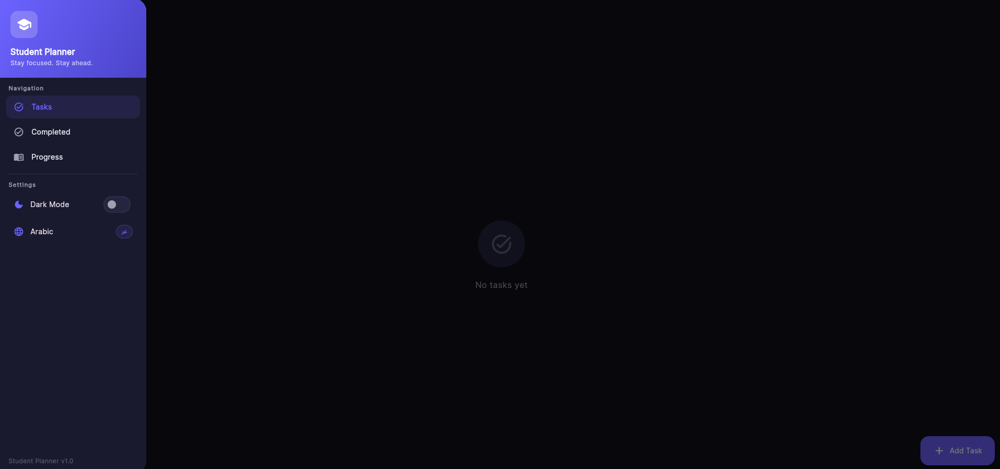
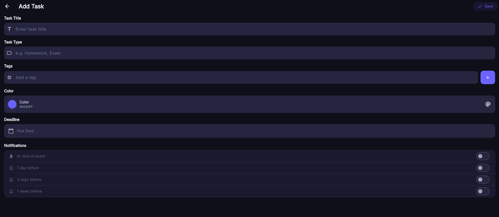

# Student Planner: Your Academic Success Partner 🎓📱

### "Stay Focused. Stay Ahead."

**Student Planner** is a modern productivity tool built with **Flutter** and **Dart**. It is specifically designed to help students manage their academic life by organizing tasks, tracking deadlines for quizzes and homework, and providing a highly customizable user experience.

---

## ✨ Features

* **Task Management:** Easily add, edit, and track academic tasks (Homework, Exams, Projects).
* **Smart Notifications:** Customizable reminders (At time of event, 1 day before, 3 days before, or 1 week before).
* **Visual Organization:** Assign specific colors and tags to different task types for better visual grouping.
* **Bilingual Support:** Full support for both **English** and **Arabic** interfaces.
* **Adaptive UI:** Seamlessly switch between **Dark Mode** and Light Mode for comfortable viewing.
* **Progress Tracking:** Dedicated sections for completed tasks and overall academic progress.

---

## 📸 Screenshots

### 1. Main Dashboard & Navigation
A clean, distraction-free interface for viewing daily tasks and a professional sidebar for easy navigation.

| Tasks View | Side Navigation |
| :---: | :---: |
|  |  |

### 2. Task Customization
Detailed task creation screen allowing students to set titles, types, tags, custom colors, and precise notification schedules.

<p align="center">
  
</p>

---

## 🛠️ Technology Stack

* **Framework:** [Flutter](https://flutter.dev/)
* **Language:** [Dart](https://dart.dev/)
* **Platform:** Web (Google Chrome) / Cross-platform compatible.
* **State Management:** [Mention what you used, e.g., Provider, Bloc, or setState]
* **Icons & UI:** Material Design 3 symbols.

---

## 🚀 Getting Started

### Prerequisites
* Flutter SDK installed on your machine.
* Dart SDK.

### Installation
1.  **Clone the repository:**
    ```bash
    git clone [https://github.com/](https://github.com/)[YOUR-USERNAME]/Academic-Task-Planner-Flutter.git
    ```
2.  **Install dependencies:**
    ```bash
    flutter pub get
    ```
3.  **Run the application:**
    ```bash
    flutter run -d chrome
    ```

---

## About the Project
This project was developed to showcase full-stack mobile/web development skills using Flutter, focusing on clean UI/UX principles and efficient task scheduling logic.
